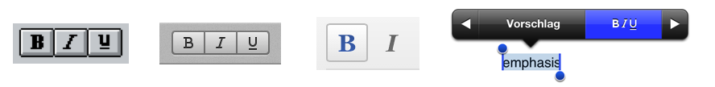
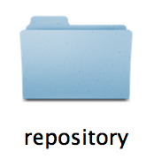
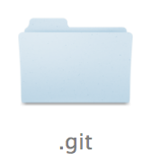
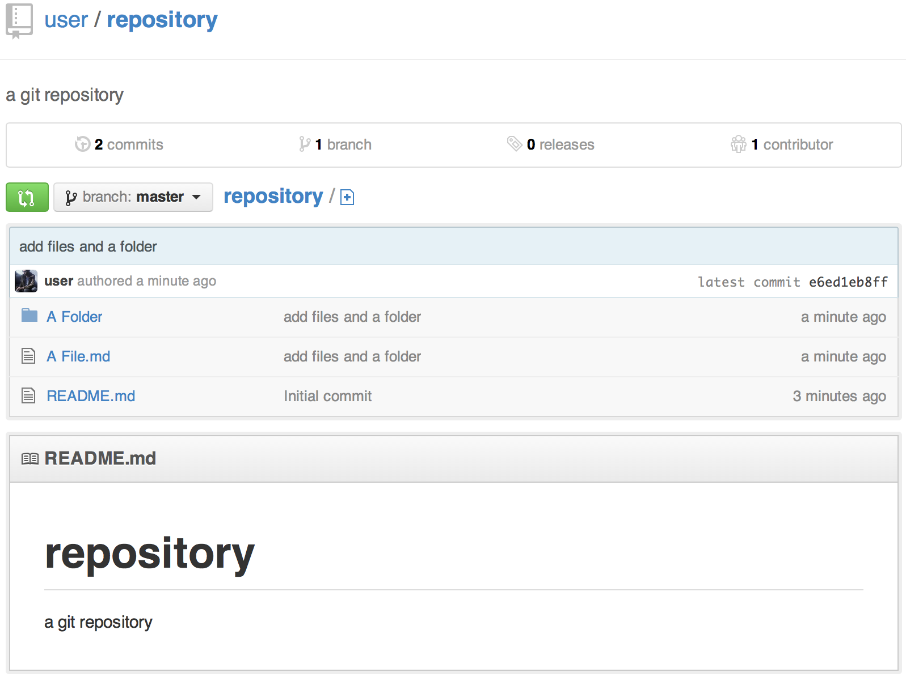

<!-- no "parts" for now -->
<!-- \part{Information} -->
<!-- <h1 id="information">Information</h1> -->

# Glossary

## `HTML`

The formatting language of the web, [invented by Tim Berners-Lee at the `CERN` in 1989](http://www.w3.org/History/1989/proposal.html).

Allows the author to write a plain text and 'mark it up' using [`<tags>`](http://www.w3.org/History/19921103-hypertext/hypertext/WWW/MarkUp/Tags.html). 
By enclosing content into them, distinct elements of a document can be created, like headings, paragraphs, images, links, and so on.
  
Made specifically to be used with `HTTP` (the `HyperText Transfer Protocoll`), which explains the meaning of the acronym: `HyperText Markup Language`.

Today, these two standards serves as the foundation of the web, along with `CSS` (for styling) and JavaScript (for interactive and programmatic elements).

  ***Example:** 
  a Document with a top-level heading with the text "Hello", followed by a paragraph with the text "World!"*

```html
<html>
<body>
  <h1>Hello</h1>
  <p>World!</p>
</body>
</html>
```


## `(La)Tex`

- invented by Donald Knuth
- wrote Book: "The Art of computer programming"
- unhappy with the state of typesetting software
- also unhappy with alternative: writing with computer, setting manually by hand
- invents `Metafont` system, `TeX`

## `git`

`Git` is a distributed version/revision control system system dubbed as "the stupid content tracker" [@link:git:readme, line. 3] developed by [Linus Thorvalds](https://en.wikipedia.org/wiki/Linus_Torvalds), more commonly known for his inception of this `Linux` kernel.
Just like Donald Knuth and his `TeX` project, Linus became so frustrated with the lack of (by his standards) good software to solve his problem, so he 


## `pandoc`


## Hidden file, -folder

Certain files or folder on a computer, 
for example configuration files belonging to software, 
can be hidden from the user by the operating system and/or file browser.
This is usually to keep the user from inadvertedly modifying or deleting them, because "seeing" them usually requires some kind of setting, command line flag or other kind of "trick".
On operating systems in the `UNIX` family, which includes `Linux` and `Mac OS X`, there is a historically grown

# Formatting

## Markup and Markdown

Historically, formatting was always "embedded" into the final document by the author or writer. Any emphasis, the position
of line breaks and paragraphs was (hopefully) copied in conjunction with the text.
With the introduction of the moveable type printing press, any text would be split up into it's composing single letters.
The complete text would

So, long before the widespread use of computers in the writing process and before the process now widely described as "Digitalization",
the printing press marks the transition from thinking about and working with text as a discrete (countable, "digital") signal, 
as opposed to the monolithic, continuous signal it was seen as before.

Not surprinsingly, the typical problems that have to be dealt with when converting any signal from continuous to discrete, from analog to digital, can be observed from this period on and are partly still not solved till now.

Suddenly, the letters of the used alphabet were not enough to properly "encode" a text so that it could be reproced properly and with loosing neither *content* nor *intent* of the author. Jan Tschichold, one of the most influential typographers of the early 20th century, is complaining about the ambivilance of paragraph positions still in the 1960, when authors already used (discrete) typewriters to turn in manuscripts:

> "Thousands of working hours are sacrificed by typographers,
> getting the right order of letters written without indentation,
> with countless pencil marks and deep thought.
> This idling could be avoided if the manuscripted would be
> handed in formatted as described here." [[@Tschichold:Drucksachen]] [^fn-tschicholdparagraphs]


## Common Pitfalls

- historic connotations - traditional way to stylize intend (partly cause of the confusion)
- ex: the intent is *emphasize*
   - the "default" style is an *italic* font variant
   - historically also underlining has been used
   - in a webbrowser, this can be taken quite literally:

The relationsship between formatting, typography and design 
is a common source of confusion. 
On the one hand, it can be summed up quite simply:

Formatting *conveys intent*, thus is part of the document's *source*. \
Design *translates* this source into an *output*, using tyography.

On the other hand, there are specific connotations embeded in our visual and cultural knowlege.
These are forged by how this translation was handled historically as well as the user interface of text editors since the 1980s:



Since the earliest text editors, 

bold, italic, underline, letter-spacing ^[in German: "Sperrung" oder "Sperrsatz"]
   
In `HTML`, there is the "`<em>`"-Tag,
which marks the enclosed text as emphasized. 

If there is no associated (`CSS`-) instruction the browser how to  *style* this tag, it uses the built-in default. 
In case of the Safari web browser, as in all relevant browsers, this defines "emphasis" as "italic":

> ```
> em {
>   font-style: italic;
> }
> ``` 
> 
> [Webkit Default CSS, Zeilen 993-995 *(shortened)*](https://github.com/WebKit/webkit/blob/453a7eab8e40608be3cbcf29c59137606f1bf4d7/Source/WebCore/css/html.css#L993-L995)


## Types of formatting

Before we look at how these problems are solved in the realm of
software developement, let's enumerate what I mean by "formatting":

* Emphasis
    - light
    - strong
  
  

---

[^fn-tschicholdparagraphs]: Original: "Tausende von Arbeitsstunden werden von Typographen geopfert, 
um einzugslos geschriebene Briefe durch unzählbare Bleistiftangaben
und Nachdenken richtig zu ordnen.
Dieser Leerlauf ließe sich vermeiden, wenn die Manuskripte gleich
in der soeben beschriebenen Art abgeliefert würden."


# Versioning

In general, *versioning* is the act of collecting, labeling, ordering and indexing all the different revisions of a document. 
By extension, this also tracks the *changes* made between those revisions, making it possible to retrace the developement of the document and possibly even the thought process of the author.

These these drafts and revisions and their comparison have spawned
diverse studies of these topics in the literary sciences, yet there is a danger of loosing this raw material as more and more authors move to produce their textual work using a computer.

This danger was also my personal starting point for this whole project, 
sparked by Cory Doctorow's essay "Extreme Geek" [[@blog:Cory:Geek]], where he writes about this problem and how he solved it for himself. 
As Doctorow summarizes in a blog post:

> "I was prompted to do this after discussions with several digital archivists who complained that, prior to the computerized era, writers produced a series complete drafts on the way to publications, complete with erasures, annotations, and so on. These are archival gold, since they illuminate the creative process […]. By contrast, many writers produce only a single (or a few) digital files that are modified right up to publication time, without any real systematic records of the interim states between the first bit of composition and the final draft."

Being a blogger, digital activist and all-round-nerd, he falls into the target group of 'technical involved' authors, so it comes a no surprise that he found a higly technical solution. He commisoned a piece of software ([`flashbake`](https://github.com/commandline/flashbake)), which automatically keeps track of his work in 15-minute-intervals.

Underneath, it uses the **`git`** version control system, which in the last years has slowly become the 
de-facto standard for versioning and collabrating open-source software project. 
It's usage grew hand in hand with the popularity of [*GitHub*](https://github.com/about), a **`git`** hosting service providing a whole ecosystem of features, 
including a web view for all files and content of the repository. This makes *GitHub* a very good example to explain the concepts and terms behind **`git`**


## Git

This chapter might seem overly technical, but I have broken down what one needs to know about **`git`** to an absolute minimum. For example, won't explain in detail how to use the **`git`** command line, or any other **`git`** interface.

Some newer graphical interfaces (especially GitHub's apps for [Mac](http://mac.github.com) and [Windows](http://windows.github.com)) make working with **`git`** so easy that the first half of this chapter is condensed to the click of a single button; the second half are 3-4 clicks in their web interface.

But: since your documents history should be as important to you as it is to Mr. Doctorow, I really want you to understand the **concepts** and **nomenclature** behind it.

The hope is to give you peace of mind that your work is *saved* and *safe*. 
Though there is a [quote from Linux Thorvalds promising exactly that](https://www.youtube.com/watch?v=4XpnKHJAok8&feature=player_detailpage&t=3529)[^fn-git-data-promise], but only with some background knowledge you can start to trust the system.
On the other hand, this same knowledge should enable you to learn how to use any **`git`** interface in a relatively short time.

[^fn-git-data-promise]:
   > "I guarantee you, if you put your data in **`git`**: 
   > You can trust, that 5 years later, after it was converted from your hard disk, to DVD, to whatever new technology, and you copied it along, 5 years later you can verify that the data you get out is the exact same data you've put in." (He goes on to explain that in the past, they were malicious agents physically breaking into a data center, trying to smuggle bad changes into the Linux kernel…)

## Repository

The most basic term a one needs to know when using **`git`** is a **"repository"**.
It is a purposefully general term, but it helps to think of it as a 'folder':



This is not even wrong: If you directly edit files in a `git` repository on 
your computer, it will be there just like any other folder.
In our case, this folder contains all the files related to a publication:

- The text files, of course
- Any non-text assets that are part of the publication, like images and figures.
- The `papermill.json` configuration file
- Any additional files that need to be tracked, or just shared.

So, what makes this folder special? 
Inside of it, there is one more thing: 
a **`hidden folder`** called `.git`!



As a user, you never directly use this folder, but it is good to know where it is and what's it's purpose.[^fn-git-folder] 
It contains lots of meta-data and also a small database-like storage. 
The **`git`** software reads and writes to this storage to faciltate all the nice things described further in this chapter. 
It may sound like "magic" at times, so keep in mind: It is just a very simple (but clever) programm which reads and writes to this small database inside your repository.

[^fn-git-folder]: Namely, if you move or copy repository-folder from one place to another (disk, computer, …).
If the folder is copied as a whole, the `.git` folder is still inside, meaning the complete versioned history is included, for good or bad.
If just single files from the folder are copied somewhere else, the `.git` is not copied with them, thus not including the history/database.

## Commit

**"commiting"** is the activity of saving your changes into the **`git`** database, 
the result of this is also called a **"commit"**.

First, you should review your changes. 
If you are happy with them, you need to tell **`git`** which files you want to commit. 
This is called **"staging"**. It allows you to make several changes at the same time, 
but only commit a fraction of them each time. 
In software developement, this is mostly done to break up the changes into smaller pieces, 
making them easier to review on the recieving side.

After all changes that should be included are staged, you can proceed with the actual commit. 
It includes:
- your name and email 
- a message explaining your changes (if you supplied one)
- a **`diff`**, a smal

The *commit message* is very important in software developement, since the text being worked on
is *source **code***, meant to be interpreted by a computer. Any changes might have side effects 
which are non-obvious by just looking at the changes.
While working with a human-language document's source however, most of the time the changes in the text don't need to be explained since the intent is already apparent from the changes.

The **"diff"**

## Branch

A brnach is 


## Collaboration

- goes hand in hand with versioning
- fun fact: collaboration can also happen between 1 person (me, and me from last week)

*GitHub* has also played a vital role in shaping the ways people are collaborating using *git*.



### Merging

If we break this process down into the individual steps, it should sound familiar to anyone who has ever collaborated on text documents with other. Even when using paper, they are the same:

- obtain a copy of the document(s) *(clone)*
- make some changes, review and save them *(comit)*
- instead of just sending the complete changed document back, formulate just the changes[^fn-manual-diff] *(diff)* 
- informing the source of the document of your changes, asking it to integrate them

Example letter:

>     Dear Sir/Madam,
>     
>     attached you find my changes to your files. 
>     I kindly ask that you apply them to your source.
>     
>     Regards,
>     Jon Doe
>     
>     ---
>     
>     Changes:
>     
>     - In the file "doc.md", in the third line, first character, I have changed the word "hello" to "world".

But instead of doing all this steps manually, we have already learned to that **`git`** takes care of the cloning, branching and commiting; and that every commit is nothing more than the differnece between the new version and the old version.

So, how do we send our changes?

Technically, there are many ways to do this. **`git`** can create an email not unlike the example letter for you, this is how [collaboration on the linux kernel](https://lkml.org/lkml/2013/7/30/63) is mostly dealt with.

Note: Gitlab calls this "Merge Request", which could be argued to be a better fitting term.

[^fn-manual-diff]: Keep in mind that even if you don't do it yourself, then whomever you sent the document to has to do it.

###

