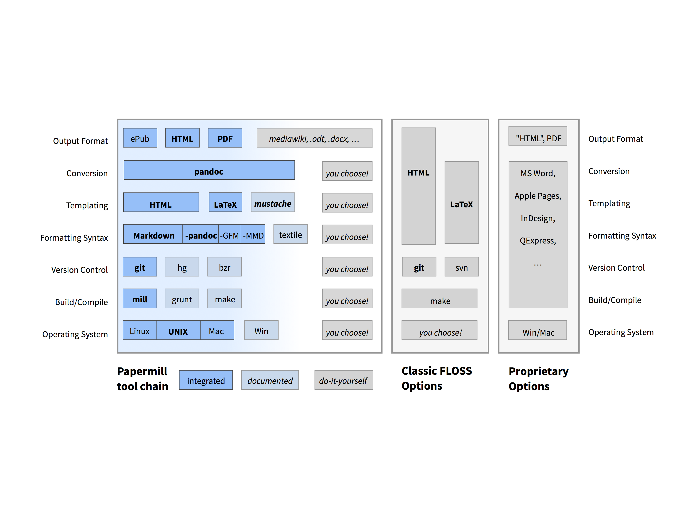
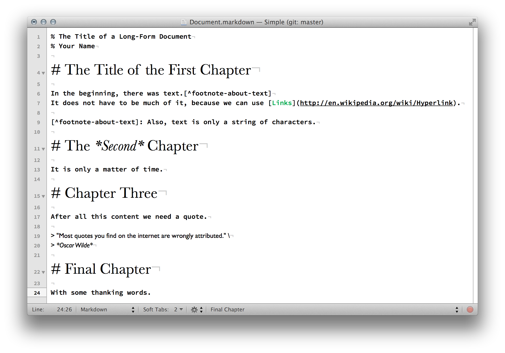
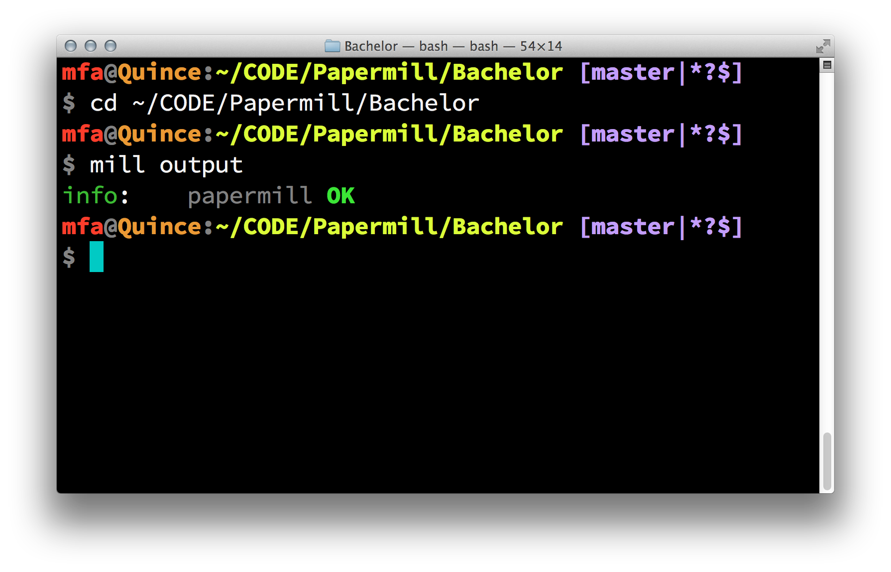
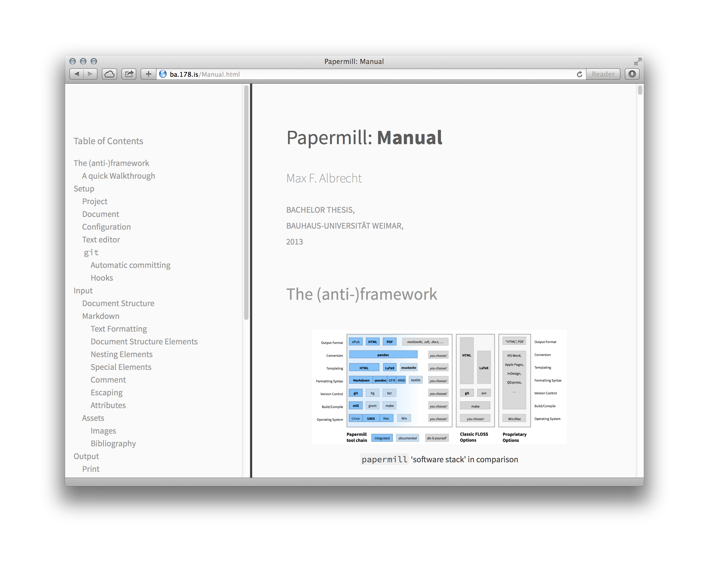
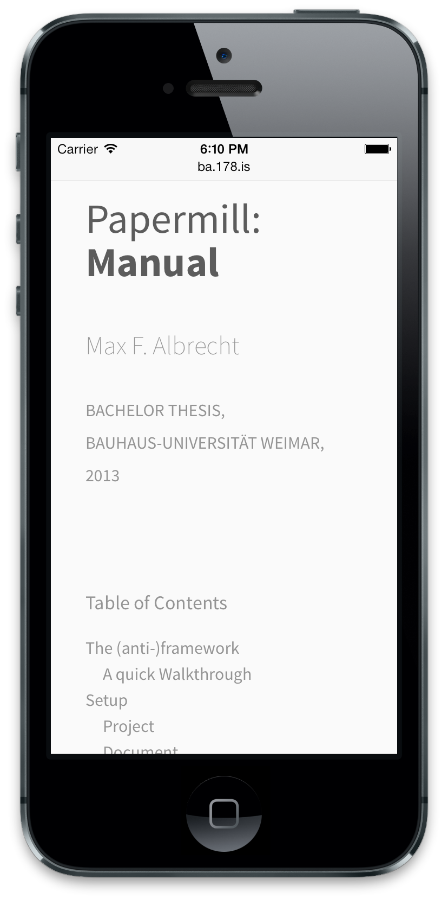
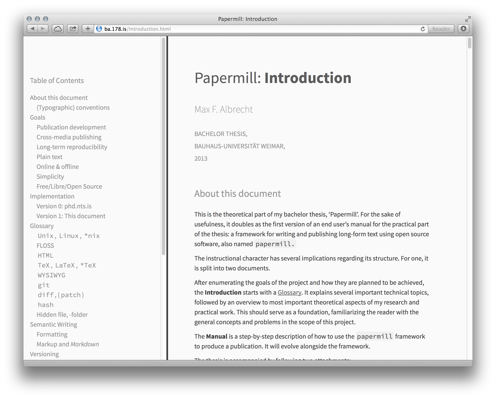
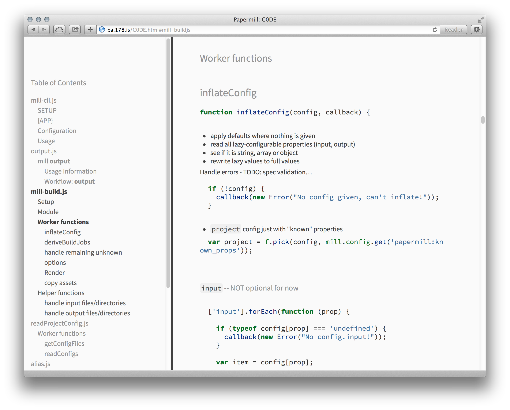

% BA-Verteidigung
% Max F. Albrecht


# `papermill`{.cursive}

 \

**Books as Software**

<aside class="notes">
  hello and welcome to the presentation
  of "papermill", 
  my bachelor project in media design.
</aside>

# 

## **Writing**

<aside class="notes">
  the main topic i will talk to you about today is
  "writing",
  which may sound strange…
</aside>

##

 Writing digital text \
 **is more easy than ever**.


## 


<aside class="notes">
  everybody has a computer, 
  they all come with a text editor
</aside>

## 


##  {data-background="images/wordpress-editor.png"}

**Publishing** digital text is \
*also more easy than ever*.
 
<aside class="notes">
>   - Software
>   - Online Services (software that runs on a company's server)
</aside>


## 

<i class="fa fa-3x fa-facebook-square"></i> 
<i class="fa fa-3x fa-twitter-square"></i> 
<i class="fa fa-3x fa-tumblr-square"></i>
<i class="fa fa-3x fa-google-plus-square"></i> 

<aside class="notes">
  the shorter the text, the more easy it
  is to publish
</aside>

#   

## **Problem**:

Writing and publishing \
**long-form text** \
is still to hard.

<aside class="notes">
>   - books 
>   - scientific papers
>   - any large body of text, really
  
  Especially when compared to other media: \
Graphic, Audio, Video, …
If we look at Video: There is software not only for editing,
but also managing files, etc, and also the **complete process of 
making a movie**. bc making movies is a process.
</aside>

##  

Writing is more than typing text. \
**It is a process.**

- Formatting and Semantics
- Footnotes, Citations, Bibliography
- Editorial Process, Collaboration
- Layout, Design, 'Prepress'
- Different output formats

<aside class="notes">
  the same is true for writing.
  
>   - formatting: convey author's intent
>       - it is not just **bold**, but **important**
>   - meta data
>   - desing
>   - output formats: Print, web, epub -> apple, kindle
</aside>

# 

## Common \
**"Solutions"**

- Word processors
<!-- - `HTML` -->
- `(La)TeX`

## Microsoft **Word** 

- has a *usability limit*.

## 

It is a word processor, \
**not a book producer**.

## 

It is **proprietary** software \
and can't be easily **automated** \
or integrated.

## 

The **source** format 
<small>(`.docx`)</small> \
is  **'closed'**, too.


<!-- ## **`HTML`**

has a high *learning curve*.

## 

```
<h2>
  <strong><code>HTML</code></strong>
</h2>

<p>has a high <em>learning curve</em>.
</p>

```

## 

It has a very common **runtime** 
<small>(the browser)</small>, \
but no good **authoring tools** for writers.

<aside class="notes">
  this doesn't mean there aren't any,
  but they are made for web designers.
</aside>
 -->
<!-- ## 

It lacks important \
**typographic features** \
<small>(even with `CSS`).</small> -->

<!-- 

## Irony

<small>**`HTML` was made for the web** — It *made* the web.</small>

<small>It was invented specifically \
to make </small>**publishing of** \
**scientific works** more easy.</small>

<small>It became so popular that it enabled \
the creation of **'web apps'**.</small>

<small>Yet, as was already shown, \
  most of these regard **other media**.</small> 

## Irony 2

<small>**`HTML` was made for the web**</small>

It *made* the web.

<small>It was invented specifically for easy</small> \
**publishing of scientific works**.

<small>It became so popular that it enabled the creation of</small> \
**'web apps'**.

<small>Yet, as was already shown, most of these regard </small> \
**other media**.

-->


## **`(La)TeX`** 

- has a **very high** *learning curve*.

##  

```
\subsection{
  \textbf{\texttt{(La)TeX}}
}\label{latex}

has a \textbf{very high} \emph{learning curve}.

```

##

`(La)TeX` is a <small>(very good)</small> **typesetting engine**, \
but not a writing environment.

## 

<small>It also doubles as a \
**programming language** \
and **runtime**.</small>

<aside class="notes">
  In latex the author still needs to be a programmer of some kind.
  
  You can use it to write papers, books, but also letters or any kind of 
  print product if you can program it.
</aside>


## **"Fuck it"**

*A very common solution*

1. Find a publisher
2. Write book
3. **There is no step 3** – <small>publisher takes care of it</small>

<aside class="notes">
  For some authors, this works just fine.
  But I believe it is a good thing to give more power to the author, so he does not depend on it.
</aside>

# 

<!-- ## **Conclusion**

- There are 'good enough' **tools** \
**for writing**, but not publishing.

- There are 'open' **tools and services** \
**for publishing**, but not writing.

- A new approach to is needed to **combine them**. -->


## The other side

 \ 

- **Programmers** already have \
  established **tools and workflows**
- Programmers who are also authors 
<small>(or vice versa)</small>   **already use these for writing**
- <small> see [Cory Doctorow: “Extreme Geek”](http://www.locusmag.com/Perspectives/2009/05/cory-doctorow-extreme-geek.html)</small>


<aside class="notes">
  Luckily there is another side, the world of software development,
  where programmers have tools,
  which is the basis and inspiration for this project
  
  Cory is using version control to keep track
  when he wrote what.
  He commissioned a small piece of software
  doing this automatically in the background,
  adding more meta data like location, weather.
  So he tracks when he wrote what, where, how…
</aside>

## <!-- Inspiration -->

From a technical standpoint, \
there is **no difference** \
between a **natural language** \
and **a programming language**.

<small>
  (Both have conventions like grammar and syntax, \
  need to be parsed, compiled, etc.)
</small>

- Challenge: **target audience**

<aside class="notes">
  Tools made by programmers, for programmers, that's what they do best.
  If we all were programmers, we could just use latex.
</aside>


#  

## Primary Goals

## <i class="fa fa-cogs"></i> **Text** \
***development***

 \

Make the \
**mode of production** and **tools** \
used in software development \
**more usable for authors** and writers.

 \ 

- Automation
- Version Control / Collaboration
- **Integration** / Modularity

<aside class="notes">
>  - automation: with lots of text, there is lot's to do,
>    we don't want to do everything manually
>  - version control, which in turn enables collaboration
>  - in general: we want a modular system, which can be 
>    integrated with other software
</aside>

## <i class="fa fa-random"></i> \
***Cross-media*** \
**publishing**

 \ 

- Media-agnostic source
- Output to print + web today
- Can be adapted for new, future media

<aside class="notes">
  Produce a document source which is as media-agnostic as possible, in the hopes that if it works for print and web today, it should be possible to adapt to the to-be-invented media of the future.
</aside>


## <i class="fa fa-suitcase"></i> **Long Term** \
***Sustainability***

 \ 

- reproducible "forever"
- at least "as long as computers exist"

<aside class="notes">
  Make sure that once written, the source of a publication can be compiled into the desired output 'forever', or at least as long as computers exist.
</aside>


#  

## Secondary Goals

## <i class="fa fa-sitemap"></i> **Structured \
Content**

 \ 

- needed for cross-publishing
- opportunity for automation

<aside class="notes">
  If the software understand the structure of the content,
  it can offer better help.
</aside>

## <i class="fa fa-align-left"></i> **Plain text**

 \ 

- most compatible format
- no "binary container" <small>(like Word, Pages, …)</small>
- software dev. tools work best with it

<aside class="notes">
  If a document is to be written in a binary container (like a Microsoft Word File), the usefulness of a software-like development process are very limited.
</aside>


## <i class="fa fa-cloud-download"></i> \
Online & offline

 \ 

- Work on **any computer** 
  <small>(i.e. Linux, Mac, Windows).</small>
- Work **without an internet connection**.

<aside class="notes">
  Roadmap: work online-only, because smartphones.
</aside>


## <i class="fa fa-check-square-o"></i> Simplicity & Documentation

 \ 

- **abstract problems away** from the user as much as possible <small>*(long term)*</small>
- provide **complete documentation** \
of the **internals** 

<aside class="notes">
  A complicated system is harder to use, explain and extend than a simple one.
  A long-term goal is to abstract away as much as possible from the user, while at the same time still providing all the necessary information for those who want or have to know what is happening in the background.
</aside>

## <i class="fa fa-unlock-alt"></i> Free-Libre-*Open-Source*

 \ 

- anything long term \
is **impossible** \
without **open source**

<aside class="notes">
  Without open source components \
  it is **impossible** to achieve \
  long-term reproducibility.
</aside>


# 

## **Implementation**

**"What is `papermill`?"**

## 

A **Proposal** \
on how to structure \
  digital publication projects.

<aside class="notes">
  Off course based on the goals I just told you about.

  structure = files as well as the  workflow
</aside>

## 
  
Several **Prototypes** \
implementing the proposal. \
 \ 

<!-- - Configuration
- Command Line Utility
- Web output theme
- Examples/Templates -->

## 
    
Two **Publications**, \
produced according to \
the proposal, using the prototypes. \
 \ 

- A general **Introduction**
- A step-by-step end user **Manual** 

<aside class="notes">
  … I realize that this is highly circular…
</aside>


# 

## **Building Blocks**

The most important parts \
are **existing tools**.


<!-- ## <i class="fa fa-code-fork"></i> **`git`**

- Version control
- distributed, fast and efficient, <small>free and open source</small> -->

## <i class="fa fa-code"></i> **`Markdown`**

Markup syntax for **humans**, \
*easy* to type and read.

## 

```markdown
## Markdown

Markup syntax for **humans**,  
*easy* to type and read.
```

## 

- made for **web authors** (bloggers)
- inspired by **email conventions**
- can be **"translated" to `HTML`**


## <i class="fa fa-copy"></i> **`(La)TeX`**

Typesetting engine

## <i class="fa fa-magic"></i> **`pandoc`**

Document Conversion Magic

- reads `Markdown` <small>(and more)</small>
- outputs to `HTML` and `(La)TeX` <small>(and more)</small>
- extends `Markdown` <small>(more than just 'web')</small>

<aside class="notes">
  Examples: MD has headings, list, links. 
  pandoc has footnotes, tables, etc. 
  pandoc also handles links as footnotes, etc.
</aside>


## <!-- Stack -->{data-background="images/papermill-stack-1.png"}

<!--  -->


# 

## **Practical Part**

 \
 
***"Developer Preview"***

 \


- **`papermill.json`**: \
  Project configuration specification
- **`mill` CLI**: \
  output according to configuration
- **`bookstrap`**: \
  Design and Layout for web output

## <i class="fa fa-archive"></i> **Project** \
***configuration***

- **`papermill`**`.json`
- information *about* the publication
    - **meta data**: author, title, etc.
    - **input**: where is the content
    - **build settings**: how to output


## 

<pre class="small">
{
  "name": "papermill",
  "author": "Max F. Albrecht",
  "description": "Bachelor Thesis (Media Design)",
  "version": "0.1.0",
  "input": {
    "bibliography": "bibliography.bib",
    "csl": ".papermill/ieee-with-url.csl",
    "list": [
      "Introduction",
      "Manual",
    ]
  },
  "output": {
    "print": {
      "class": "book",
      "mainfont": "Source Sans Pro",
      "monofont": "Source Code Pro",
      "fontsize": "11pt"
      "geometry": "a4paper, centering, bindingoffset=15mm",
    }
  },
  "license": "MIT",
}
</pre>

## 

<pre class="small">
{
  "<b>input</b>": {
    "<b>bibliography</b>": "bibliography.bib",
    "<b>csl</b>": ".papermill/ieee-with-url.csl",
    "<b>list</b>": [
      "Introduction",
      "Manual",
    ]
  }</b>
}
</pre>

<aside class="notes">
  feature: this lists folders, 
  all files in it are combined in order
</aside>

## 

<pre class="small">
{
  "<b>output</b>": {
    <i>"web": true</i>,
    "<b>print</b>": {
      "<b>class</b>": "book",
      "<b>mainfont</b>": "Source Sans Pro",
      "monofont": "Source Code Pro",
      "fontsize": "11pt"
      "<b>geometry</b>": "a4paper, centering, bindingoffset=15mm",
    }
  }
}
</pre>

## 

simple examples/templates \
are [available online](https://github.com/papermill/stationery) (**"stationery"**)

## {data-background="images/stationery-simple-editor.png"}

<!--  -->

## 


## <i class="fa fa-terminal"></i> **`mill`** **CLI**

Reads project config <small>(`papermill.json`)</small>, \
**compiles output** with `pandoc` \
(web and print).

## 



<!-- ````
mfa@Quince:~/CODE/Papermill/Bachelor
$ mill output
info:    papermill OK
```` -->

## 

- written in `node.js` (JavaScript)
- functionality inside <small>(small)</small> **modules**
- can be used in server application


## <i class="fa fa-file-text"></i> **`bookstrap`**

Design and Layout for web output

- uses 'modern web' tech <small>(`HTML5`, `CSS3`)</small>
- 'progressive enhancement' <small>(mobile-first)</small>
- markup readable on any (old) browser

<aside class="notes">
  This means the result can be read in any browser.
  Any 'modern' features are add-ons, only work if the 
  browser supports it.
  Otherwise, the (readable) default is used.
</aside>


## {data-background="images/manual-web.png"}

<!--  -->


## {xdata-background="images/manual-iphone.png"}



<!-- **Manual**: obligatory iPhone screen shot -->

## 

- builds on `bootstrap` v3
- focus on **readability**
- **'grid'** based on typographic units
- basic 'responsive' layout <small>(Table of Contents)</small>

<aside class="notes">
  layout adjusts to screen size
</aside>

# 

## Theoretical Part

 \

**Introduction** & **Manual**

<aside class="notes">
</aside>

## **Introduction**

 \ 

- **Glossary**
- **Goals**, Philosophy
- **Versioning** with `git`


## 



## {data-background="black"}

<!-- [Introduction print] -->


## **Manual**

A step-by-step description of the process \
of producing and publishing a book.

 \ 

- **Setup**: start from scratch
- **Input**: how to write content 
    - complete Markdown reference
    - handle assets
- **Output**: for web and print
    - adjust design/layout

## 


## {data-background="black"}

<!-- [Manual print] -->

#  

## **Conclusion**

## <!-- reflection -->

***"Developer Preview"…***

- not (yet) usable for end user
- stable and consistent basic framework \
  for further developement

# 

## **Roadmap**

## **API** <i class="fa fa-cloud"></i>

**"Application Programming Interface"**

- Compile publications "in the cloud"
- <small>no need to install ~2GB of dependencies</small>

## **CI** <i class="fa fa-truck fa-flip-horizontal"></i> 

**"Continuous Integration"**

- write local, compile global

## **IDE** <i class="fa fa-home"></i>

**"Integrated \
Development Environment"**

- write and publish in a web browser

# 

## **Call for Contributions**

 \ 

- <http://alpha.papermill.in>
- <https://github.com/papermill>

 <!-- \ 

"Low-hanging fruits":

- `grunt init`
- `bower` support -->


## Bonus: **`C0DE`**

[](http://ba.178.is/C0DE.html)

<style>
/* icons from font awesome */
@import url(http://fonts.googleapis.com/css?family=Source+Sans+Pro:400,600,400italic,600italic|Source+Code+Pro:400,600,500|Grand+Hotel);
@import url(http://netdna.bootstrapcdn.com/font-awesome/4.0.3/css/font-awesome.css);
.reveal i.fa {
  font-style: normal;
  font-family: FontAwesome;
}
.reveal i.fa-3x {
  font-size: 3em;
} 
/* for overriding 'simple' theme */
.reveal {
  font-size: 4em;
  font-family: "Source Sans Pro", sans-serif;
  font-weight: 600;
  color: #444;
}
b, strong {
  font-weight: 700;
}
.reveal h1,
.reveal h2,
.reveal h3,
.reveal h4,
.reveal h5,
.reveal h6 {
  letter-spacing: inherit;
  text-transform: inherit;
  font-family: inherit;
  font-weight: inherit;
  color: #444;
}
.reveal pre, .reveal code {
	font-family: "Source Code Pro", monospace;
  font-weight: 500;
  box-shadow: none;
}
.reveal strong code {
  font-weight: 700;
}
.reveal pre.small {
  font-size: 0.5em;
}
.reveal ul, .reveal ul ul {
  list-style-type: none;
  text-align: inherit;
  margin: 0;
}
.reveal ol li {
  list-style-type: none;
  counter-increment: list;
  margin-left: 1em;
}
.reveal ul li::before, ol li::before {
  content: "→ ";
  color: #888;
  font-weight: 700;
  margin-left: -1em;
}
.reveal ol li::before {
  content: counter(list) ". ";
}
.reveal ul ul li::before {
  content: "◉ ";
}
.cursive, code.cursive {
  font-family: 'Grand Hotel', cursive;
  letter-spacing: 0;
}
.reveal small {
  vertical-align: baseline;
}
.reveal section img {
  border: none;
  box-shadow: none;
}
.reveal .controls div.navigate-left,
.reveal .controls div.navigate-left.enabled {
  border-right-color: hsl(200, 100%, 25%); }

.reveal .controls div.navigate-right,
.reveal .controls div.navigate-right.enabled {
  border-left-color: hsl(200, 100%, 25%); }

.reveal .controls div.navigate-up,
.reveal .controls div.navigate-up.enabled {
  border-bottom-color: hsl(200, 100%, 25%); }

.reveal .controls div.navigate-down,
.reveal .controls div.navigate-down.enabled {
  border-top-color: hsl(200, 100%, 25%); }

.reveal .controls div.navigate-left.enabled:hover {
  border-right-color: hsl(200, 100%, 40%); }

.reveal .controls div.navigate-right.enabled:hover {
  border-left-color: hsl(200, 100%, 40%); }

.reveal .controls div.navigate-up.enabled:hover {
  border-bottom-color: hsl(200, 100%, 40%); }

.reveal .controls div.navigate-down.enabled:hover {
  border-top-color: hsl(200, 100%, 40%); }

.reveal .progress {
  height: 0.8%;
  background: hsl(200, 100%, 25%);
}
.reveal .progress span {
  background: #fff;
}
</style>